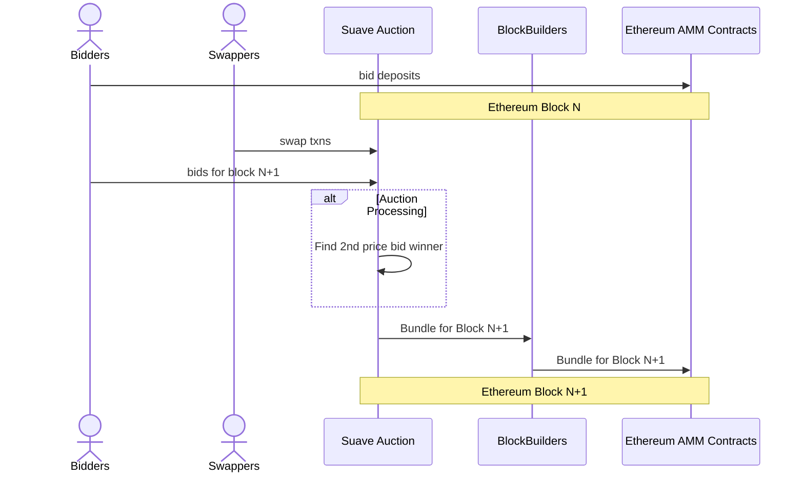

# [TLDR](https://www.tldresear.ch/) Fellowship Project Repo

This repo explores how on-chain solidity smart contracts are able to take control of their own sequencing for the sake of capturing the MEV that they generate. This repo focuses on AMMs as an example protocol, as both the LPs and traders of AMMs lose money due to not being able to control the sequencing of trades that occur on-chain. The repo itself is a PoC of a system that captures and reroutes money that is normally extracted from users back to the users.

Normal AMMs lose money due to [loss versus rebalancing (LVR)](https://a16zcrypto.com/posts/article/lvr-quantifying-the-cost-of-providing-liquidity-to-automated-market-makers/), which can be conceptualized as the AMM's LPs being forced to take the bad half of a trade. If an entity is willing to pay for the right to be the first to take a trade, then some of the LVR loss can be recaputured as profit. For ethereum L1, block builders are performing and benefitting from this auction already in their block building process as top of block CEX-DEX arbitrague. In this repo, the AMM takes away the right of the block builder to choose who gets to trade first and instead performs the auction itself. In this way, the AMM is able to capture some of the MEV that it generates instead of leaving it on the floor for block builders to consume. 

This repo is different from other<sup>[1](https://arxiv.org/html/2403.03367v1),[2](https://ethresear.ch/t/mev-capturing-amm-mcamm/13336),[3](https://arxiv.org/abs/2210.10601)</sup> proposed AMM auction constructs in that it leverages TEEs (trusted execution environments) to manage and run the auction instead of involving the block builder or other new manager identities. Flashbot's block building platform [SUAVE](https://suave-alpha.flashbots.net/what-is-suave) is used as the TEE provider. 


## System Components


This system is built out of solidity contracts on a target vanilla EVM chain and on Suave. The AMM is minimally modified to only allow swaps after the winner of the auction performs their swap. The auction contract facilitates: collecting normal swap transactions, collecting bids, and running the auction once per target EVM block. The auction contract has its own private key that it constructs and signs transactions with, the target chain's contracts know the address of this key and will only accept auction results that are signed by this key. 

The auction contract sends a [bundle](https://docs.flashbots.net/flashbots-auction/advanced/rpc-endpoint#eth_sendbundle) of transactions to the target chain's block builders for inclusion. Builders are trusted to not break the bundles apart, but the smart contracts in this setup also enforce that swaps will fail if the auction's results are not respected. 

See below a diagram of the system:



## How to run
1. Download this repo and init the submodules:
   ```
   git clone https://github.com/Lilyjjo/tldr-research.git
   git submodule update --init --recursive
   ```

2. Setup the needed environment variables in `/solidity_code/.env` from the template `/solidity_code/.sample_env`. 

3. Decide if you want to run locally or on Suave's testnet (testnet is recommended, it's easier than running your own node)
   
   If you want to run locally:
   Download [`suave-geth`](https://github.com/flashbots/suave-geth) and run with: 
   ```
   ./build/bin/geth --suave.dev --syncmode=snap --datadir YOUR_DESIRED_DATADIR_LOCATION --http --http.api eth,net,engine,admin,suavex --http.addr 127.0.0.1 --http.port 8545 --suave.eth.external-whitelist "*"
   ```

4. Setup the L1 contracts
   
   Setting up the L1 contract takes about ~10 minutes to run. It deploys and initializes all of the uniswap code, the L1 auction code, and sets up the swapper and bidders with the needed funds and state to be able to swap the pool's tokens and place bids on the auction contract. All of the bidder/swapper keys in the .env need funds on the target L1 for this to complete. 
   ```
   cd solidity_code
   forge script script/Deployments.s.sol:Deployments --broadcast --legacy -vv --sig "freshL1Contracts(bool,bool)" true true
   ```
5. Put the outputted deployed addresses into `solidity_code/.env`. Those addresses are used for deploying the Suave contracts and by the rust servers.
6. Deploy the Suave Auction contract
   ```
   cd solidity_code
   forge script script/Deployments.s.sol:Deployments --sig "deploySuaveAMMAuction()" --broadcast --legacy -vv
   ```
7. Put the outputted deployed address into `solidity_code/.env`.
8. Initalize the suapp's inital state
   This command is flakey, run until all 3 CCRs are sent.
   ```
   cd rust_interactions
   ./target/debug/auction-cli amm-auction initialize-suapp
   ```
9. Run the block server and watch as `bidder_0` and `swapper_0`'s transactions are eventually included. You can tell successful bundle lands when the used nonce goes up.
   ```
   cd rust_interactions
   ./target/debug/auction-block-listener
   ```

When running an auction through the rust servers, this is what the output looks like on the happy-path:
```
[~~~~  running auction for block: 1472520 ~~~~]
--> sent bid for bidder_0 for: 14
--> sent bid for bidder_1 for: 6
--> sent bid for bidder_2 for: 84
--| triggered auction
Auction Stats
  auctioned block      : 1472520
  last nonce used      : 113
  included swap txns   : 0
  total landed         : 2
  winning bid $        : 14
[~~~~  running auction for block: 1472521 ~~~~]
--> sent bid for bidder_0 for: 92
--> sent bid for bidder_1 for: 16
...
```
The auction is 2nd price, but having the bids included is flakey. The bids are currently stored in the suapp's contract storage instead of in the confidential store. The contract storage only updates when Rigil has blocks produced, so when the auction get triggered it's not guaranteed that the bids have populated the contract storage yet. Fixing this is a TODO in a future version. 

For the same reason the Auction Stats are can report from older auctions. These stats are being pulled from the suapp's contract storage to show what is actually happening inside of the kettle post execution. 
